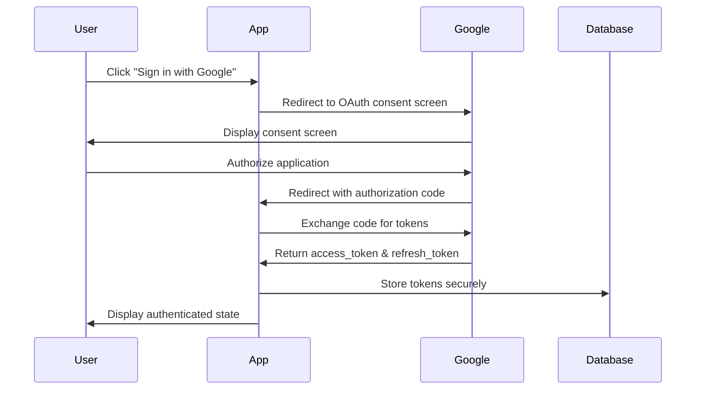
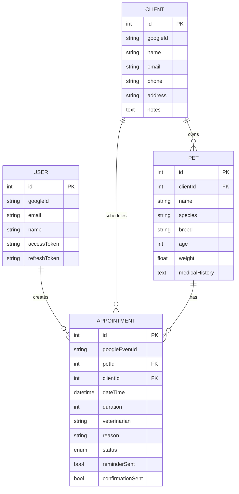

# VetSoft - Veterinary Clinic Management System

## Technical Specification Document

---

## 1. Project Overview

### 1.1 Purpose

VetSoft is a comprehensive veterinary clinic management system designed to automate appointment scheduling through Google Calendar integration, send automated email notifications via Gmail API, and provide secure authentication through Google OAuth 2.0. The application will be built as a web application with Electron WebView capability for desktop deployment.

### 1.2 Key Objectives

- Streamline appointment scheduling with Google Calendar synchronization
- Automate client communication through email notifications
- Provide a unified platform for managing pets, owners, and appointments
- Deliver a professional, responsive user experience across devices

### 1.3 Target Users

- Veterinary clinic staff (receptionists, veterinarians, managers)
- Pet owners who need to schedule appointments and receive notifications
- Clinic administrators who manage staff and operations

### 1.4 Technology Stack

| Layer | Technology | Version |
|-------|------------|---------|
| Frontend Framework | React | 18.x |
| Build Tool | Vite | 5.x |
| Desktop Runtime | Electron | 28.x |
| State Management | Zustand | 4.x |
| Routing | React Router | 6.x |
| Calendar Library | FullCalendar | 6.x |
| HTTP Client | Axios | 1.x |
| Styling | Tailwind CSS | 3.x |
| UI Components | Headless UI / Radix UI | Latest |
| Local Database | better-sqlite3 / Dexie.js | Latest |
| Google APIs | @react-oauth/google | Latest |

---

## 2. System Architecture

### 2.1 Architecture Overview

The application follows a client-server architecture with local data persistence. Google APIs provide external service integration while the Electron desktop shell provides native system capabilities.

```
┌─────────────────────────────────────────────────────────────────┐
│                        ELECTRON SHELL                           │
│  ┌─────────────┐  ┌─────────────┐  ┌─────────────────────────┐  │
│  │   Window    │  │   IPC       │  │   Native APIs           │  │
│  │   Manager   │  │   Bridge    │  │   (Notifications, FS)   │  │
│  └─────────────┘  └─────────────┘  └─────────────────────────┘  │
└─────────────────────────────────────────────────────────────────┘
                              │
                              ▼
┌─────────────────────────────────────────────────────────────────┐
│                     VITE + REACT APPLICATION                    │
│  ┌─────────────────────────────────────────────────────────────┐ │
│  │                    PRESENTATION LAYER                       │ │
│  │  ┌──────────┐ ┌──────────┐ ┌──────────┐ ┌──────────────┐  │ │
│  │  │  Pages   │ │Components│ │  Hooks   │ │   Context    │  │ │
│  │  └──────────┘ └──────────┘ └──────────┘ └──────────────┘  │ │
│  └─────────────────────────────────────────────────────────────┘ │
│                              │                                   │
│                              ▼                                   │
│  ┌─────────────────────────────────────────────────────────────┐ │
│  │                    BUSINESS LOGIC LAYER                      │ │
│  │  ┌──────────┐ ┌──────────┐ ┌──────────┐ ┌──────────────┐  │ │
│  │  │ Services │ │  Stores  │ │ Validators│ │  Utilities   │  │ │
│  │  └──────────┘ └──────────┘ └──────────┘ └──────────────┘  │ │
│  └─────────────────────────────────────────────────────────────┘ │
│                              │                                   │
│                              ▼                                   │
│  ┌─────────────────────────────────────────────────────────────┐ │
│  │                      DATA LAYER                             │ │
│  │  ┌──────────────────┐  ┌──────────────────────────────────┐│ │
│  │  │  Local Database  │  │      Google API Integration      ││ │
│  │  │   (IndexedDB)    │  │  ┌──────┐ ┌───────┐ ┌─────────┐  ││ │
│  │  │                   │  │  │OAuth │ │Calendar│ │  Gmail  │  ││ │
│  │  │                   │  │  └──────┘ └───────┘ └─────────┘  ││ │
│  │  └──────────────────┘  └──────────────────────────────────┘│ │
│  └─────────────────────────────────────────────────────────────┘ │
└─────────────────────────────────────────────────────────────────┘
```

### 2.2 System Components

#### Frontend Application (Vite + React)

The React application serves as the core user interface, handling all client-side operations including:
- User authentication and session management
- Appointment CRUD operations
- Calendar visualization and interaction
- Client and patient data management
- Notification preferences

#### Electron Desktop Shell

The Electron wrapper provides:
- Native window management with system tray integration
- Desktop notifications for appointment reminders
- File system access for data export/import
- Auto-update capability
- Offline-capable desktop application

#### Google API Integration Layer

Handles all communication with Google services:
- OAuth 2.0 authentication flow
- Calendar event creation, modification, and deletion
- Email composition and sending via Gmail
- Token refresh and session management

#### Local Data Persistence

IndexedDB via Dexie.js stores:
- Client and patient records
- Appointment history
- User preferences
- Cache for offline capability

### 2.3 Data Flow

```
┌──────────────┐     ┌──────────────┐     ┌──────────────┐
│   User       │────▶│   React      │────▶│   Service    │
│   Action     │     │   Component  │     │   Layer      │
└──────────────┘     └──────────────┘     └──────────────┘
                                                │
                    ┌───────────────────────────┼───────────────────────────┐
                    │                           │                           │
                    ▼                           ▼                           ▼
         ┌──────────────────┐      ┌──────────────────┐      ┌──────────────────┐
         │  IndexedDB       │      │  Google Calendar │      │  Google Gmail    │
         │  (Local Storage) │      │  API              │      │  API             │
         └──────────────────┘      └──────────────────┘      └──────────────────┘
```

---

## 3. Component Structure

### 3.1 Application Structure

```
src/
├── main.tsx                 # Application entry point
├── App.tsx                  # Root component with routing
├── index.css                # Global styles
│
├── components/              # Reusable UI components
│   ├── ui/                  # Base UI components
│   │   ├── Button.tsx
│   │   ├── Input.tsx
│   │   ├── Modal.tsx
│   │   ├── Card.tsx
│   │   ├── Badge.tsx
│   │   └── Loader.tsx
│   │
│   ├── layout/              # Layout components
│   │   ├── Sidebar.tsx
│   │   ├── Header.tsx
│   │   ├── Footer.tsx
│   │   └── Layout.tsx
│   │
│   ├── calendar/            # Calendar components
│   │   ├── CalendarView.tsx
│   │   ├── DayView.tsx
│   │   ├── WeekView.tsx
│   │   ├── MonthView.tsx
│   │   └── AppointmentModal.tsx
│   │
│   ├── appointments/       # Appointment components
│   │   ├── AppointmentCard.tsx
│   │   ├── AppointmentForm.tsx
│   │   ├── AppointmentList.tsx
│   │   └── AppointmentDetails.tsx
│   │
│   ├── clients/             # Client management components
│   │   ├── ClientList.tsx
│   │   ├── ClientCard.tsx
│   │   ├── ClientForm.tsx
│   │   └── ClientDetails.tsx
│   │
│   ├── pets/                # Pet management components
│   │   ├── PetList.tsx
│   │   ├── PetCard.tsx
│   │   ├── PetForm.tsx
│   │   └── PetDetails.tsx
│   │
│   └── auth/                # Authentication components
│       ├── LoginButton.tsx
│       ├── AuthProvider.tsx
│       └── ProtectedRoute.tsx
│
├── pages/                   # Page components
│   ├── Dashboard.tsx
│   ├── Appointments.tsx
│   ├── Calendar.tsx
│   ├── Clients.tsx
│   ├── Pets.tsx
│   ├── Settings.tsx
│   └── Login.tsx
│
├── services/                # Business logic services
│   ├── google/
│   │   ├── authService.ts
│   │   ├── calendarService.ts
│   │   └── gmailService.ts
│   ├── appointmentService.ts
│   ├── clientService.ts
│   ├── petService.ts
│   └── notificationService.ts
│
├── stores/                  # State management (Zustand)
│   ├── authStore.ts
│   ├── appointmentStore.ts
│   ├── clientStore.ts
│   ├── petStore.ts
│   └── uiStore.ts
│
├── hooks/                   # Custom React hooks
│   ├── useAuth.ts
│   ├── useAppointments.ts
│   ├── useClients.ts
│   ├── usePets.ts
│   ├── useGoogleCalendar.ts
│   └── useGoogleGmail.ts
│
├── lib/                     # Utilities and helpers
│   ├── db.ts                # IndexedDB configuration
│   ├── google.ts            # Google API helpers
│   ├── utils.ts
│   ├── constants.ts
│   └── types.ts
│
├── contexts/                # React contexts
│   └── AuthContext.tsx
│
└── assets/                  # Static assets
    ├── images/
    └── icons/
```

### 3.2 Component Hierarchy

```
App
├── AuthProvider
│   └── ProtectedRoute
│       ├── Layout
│       │   ├── Sidebar
│       │   ├── Header
│       │   └── MainContent
│       │       ├── Dashboard
│       │       │   ├── StatsCards
│       │       │   ├── UpcomingAppointments
│       │       │   └── QuickActions
│       │       │
│       │       ├── Appointments
│       │       │   ├── AppointmentList
│       │       │   ├── AppointmentForm
│       │       │   └── AppointmentDetails
│       │       │
│       │       ├── Calendar
│       │       │   ├── CalendarView
│       │       │   ├── DayView
│       │       │   ├── WeekView
│       │       │   └── MonthView
│       │       │
│       │       ├── Clients
│       │       │   ├── ClientList
│       │       │   ├── ClientCard
│       │       │   └── ClientForm
│       │       │
│       │       ├── Pets
│       │       │   ├── PetList
│       │       │   ├── PetCard
│       │       │   └── PetForm
│       │       │
│       │       └── Settings
│       │           ├── ProfileSettings
│       │           ├── NotificationSettings
│       │           └── IntegrationSettings
│       │
│       └── Login (when not authenticated)
```

---

## 4. API Integration Details

### 4.1 Google OAuth 2.0 Authentication

#### Configuration Requirements

1. **Google Cloud Console Setup**:
   - Create a project in Google Cloud Console
   - Enable the following APIs:
     - Google Calendar API
     - Gmail API
   - Configure OAuth 2.0 consent screen
   - Create OAuth 2.0 credentials (Client ID and Client Secret)

2. **Authorized Redirect URIs**:
   - Development: `http://localhost:5173/auth/callback`
   - Production: `https://your-domain.com/auth/callback`
   - Electron: `http://localhost:5173/auth/callback`

3. **Required Scopes**:
   ```
   - openid                  # OpenID Connect
   - email                   # Email address
   - profile                 # Basic profile info
   - https://www.googleapis.com/auth/calendar.events     # Calendar events
   - https://www.googleapis.com/auth/gmail.send          # Send emails
   - https://www.googleapis.com/auth/gmail.readonly       # Read emails
   ```

#### Authentication Flow



#### Implementation

```typescript
// services/google/authService.ts

interface GoogleAuthConfig {
  clientId: string;
  redirectUri: string;
  scope: string[];
  responseType: string;
}

const AUTH_CONFIG: GoogleAuthConfig = {
  clientId: import.meta.env.VITE_GOOGLE_CLIENT_ID,
  redirectUri: `${window.location.origin}/auth/callback`,
  scope: [
    'openid',
    'email',
    'profile',
    'https://www.googleapis.com/auth/calendar.events',
    'https://www.googleapis.com/auth/gmail.send',
    'https://www.googleapis.com/auth/gmail.readonly'
  ],
  responseType: 'code'
};

export const getAuthUrl = (): string => {
  const params = new URLSearchParams({
    client_id: AUTH_CONFIG.clientId,
    redirect_uri: AUTH_CONFIG.redirectUri,
    response_type: AUTH_CONFIG.responseType,
    scope: AUTH_CONFIG.scope.join(' '),
    access_type: 'offline',
    prompt: 'consent'
  });
  
  return `https://accounts.google.com/o/oauth2/v2/auth?${params}`;
};

export const exchangeCodeForTokens = async (code: string): Promise<Tokens> => {
  const response = await fetch('https://oauth2.googleapis.com/token', {
    method: 'POST',
    headers: {
      'Content-Type': 'application/x-www-form-urlencoded'
    },
    body: new URLSearchParams({
      code,
      client_id: AUTH_CONFIG.clientId,
      client_secret: import.meta.env.VITE_GOOGLE_CLIENT_SECRET,
      redirect_uri: AUTH_CONFIG.redirectUri,
      grant_type: 'authorization_code'
    })
  });
  
  return response.json();
};

export const refreshAccessToken = async (refreshToken: string): Promise<Tokens> => {
  const response = await fetch('https://oauth2.googleapis.com/token', {
    method: 'POST',
    headers: {
      'Content-Type': 'application/x-www-form-urlencoded'
    },
    body: new URLSearchParams({
      refresh_token: refreshToken,
      client_id: AUTH_CONFIG.clientId,
      client_secret: import.meta.env.VITE_GOOGLE_CLIENT_SECRET,
      grant_type: 'refresh_token'
    })
  });
  
  return response.json();
};
```

### 4.2 Google Calendar API Integration

#### Features

- Create calendar events for appointments
- Update existing events
- Delete events when appointments are cancelled
- Retrieve events for calendar view
- Set reminders for appointments

#### Implementation

```typescript
// services/google/calendarService.ts

interface CalendarEvent {
  summary: string;
  description: string;
  start: {
    dateTime: string;
    timeZone: string;
  };
  end: {
    dateTime: string;
    timeZone: string;
  };
  attendees?: Array<{ email: string }>;
  reminders?: {
    useDefault: boolean;
    overrides?: Array<{ method: string; minutes: number }>;
  };
}

const CALENDAR_BASE_URL = 'https://www.googleapis.com/calendar/v3';

export const createCalendarEvent = async (
  accessToken: string,
  event: CalendarEvent,
  calendarId: string = 'primary'
): Promise<CalendarEvent> => {
  const response = await fetch(
    `${CALENDAR_BASE_URL}/calendars/${calendarId}/events`,
    {
      method: 'POST',
      headers: {
        Authorization: `Bearer ${accessToken}`,
        'Content-Type': 'application/json'
      },
      body: JSON.stringify(event)
    }
  );
  
  return response.json();
};

export const updateCalendarEvent = async (
  accessToken: string,
  eventId: string,
  event: Partial<CalendarEvent>,
  calendarId: string = 'primary'
): Promise<CalendarEvent> => {
  const response = await fetch(
    `${CALENDAR_BASE_URL}/calendars/${calendarId}/events/${eventId}`,
    {
      method: 'PATCH',
      headers: {
        Authorization: `Bearer ${accessToken}`,
        'Content-Type': 'application/json'
      },
      body: JSON.stringify(event)
    }
  );
  
  return response.json();
};

export const deleteCalendarEvent = async (
  accessToken: string,
  eventId: string,
  calendarId: string = 'primary'
): Promise<void> => {
  await fetch(
    `${CALENDAR_BASE_URL}/calendars/${calendarId}/events/${eventId}`,
    {
      method: 'DELETE',
      headers: {
        Authorization: `Bearer ${accessToken}`
      }
    }
  );
};

export const getCalendarEvents = async (
  accessToken: string,
  timeMin: string,
  timeMax: string,
  calendarId: string = 'primary'
): Promise<{ items: CalendarEvent[] }> => {
  const params = new URLSearchParams({
    timeMin,
    timeMax,
    singleEvents: 'true',
    orderBy: 'start  
  const response = await fetch(
Time'
  });
    `${CALENDAR_BASE_URL}/calendars/${calendarId}/events?${params}`,
    {
      headers: {
        Authorization: `Bearer ${accessToken}`
      }
    }
  );
  
  return response.json();
};
```

### 4.3 Google Gmail API Integration

#### Features

- Send appointment confirmation emails
- Send appointment reminder emails
- Send appointment cancellation notifications
- Include rich HTML content in emails

#### Implementation

```typescript
// services/google/gmailService.ts

interface EmailMessage {
  to: string;
  subject: string;
  body: string;
  html?: string;
}

const GMAIL_BASE_URL = 'https://gmail.googleapis.com/gmail/v1/users/me';

const encodeEmail = (message: EmailMessage): string => {
  const headers = [
    `To: ${message.to}`,
    `Subject: ${message.subject}`,
    'Content-Type: text/html; charset=UTF-8',
    '',
    message.html || message.body
  ].join('\n');
  
  return btoa(headers).replace(/\+/g, '-').replace(/\//g, '_').replace(/=+$/, '');
};

export const sendEmail = async (
  accessToken: string,
  message: EmailMessage
): Promise<{ id: string }> => {
  const encodedMessage = encodeEmail(message);
  
  const response = await fetch(`${GMAIL_BASE_URL}/messages/send`, {
    method: 'POST',
    headers: {
      Authorization: `Bearer ${accessToken}`,
      'Content-Type': 'application/json'
    },
    body: JSON.stringify({
      raw: encodedMessage
    })
  });
  
  return response.json();
};

export const sendAppointmentConfirmation = async (
  accessToken: string,
  recipientEmail: string,
  appointment: Appointment,
  client: Client,
  pet: Pet
): Promise<{ id: string }> => {
  const subject = `Appointment Confirmation - ${pet.name} with Dr. ${appointment.veterinarian}`;
  const html = `
    <div style="font-family: Arial, sans-serif; max-width: 600px; margin: 0 auto;">
      <h1 style="color: #2c7a7b;">Appointment Confirmed!</h1>
      <p>Dear ${client.name},</p>
      <p>Your appointment has been confirmed. Here are the details:</p>
      
      <div style="background: #f7fafc; padding: 20px; border-radius: 8px; margin: 20px 0;">
        <p><strong>Pet:</strong> ${pet.name} (${pet.species})</p>
        <p><strong>Date:</strong> ${new Date(appointment.dateTime).toLocaleDateString()}</p>
        <p><strong>Time:</strong> ${new Date(appointment.dateTime).toLocaleTimeString()}</p>
        <p><strong>Veterinarian:</strong> Dr. ${appointment.veterinarian}</p>
        <p><strong>Reason:</strong> ${appointment.reason}</p>
      </div>
      
      <p>If you need to reschedule or cancel, please contact us at least 24 hours in advance.</p>
      
      <p>Best regards,<br>VetSoft Team</p>
    </div>
  `;
  
  return sendEmail(accessToken, {
    to: recipientEmail,
    subject,
    html
  });
};

export const sendAppointmentReminder = async (
  accessToken: string,
  recipientEmail: string,
  appointment: Appointment,
  client: Client,
  pet: Pet
): Promise<{ id: string }> => {
  const subject = `Appointment Reminder - ${pet.name} Tomorrow`;
  const html = `
    <div style="font-family: Arial, sans-serif; max-width: 600px; margin: 0 auto;">
      <h1 style="color: #d69e2e;">Appointment Reminder</h1>
      <p>Dear ${client.name},</p>
      <p>This is a friendly reminder about your upcoming appointment:</p>
      
      <div style="background: #f7fafc; padding: 20px; border-radius: 8px; margin: 20px 0;">
        <p><strong>Pet:</strong> ${pet.name}</p>
        <p><strong>Date:</strong> ${new Date(appointment.dateTime).toLocaleDateString()}</p>
        <p><strong>Time:</strong> ${new Date(appointment.dateTime).toLocaleTimeString()}</p>
        <p><strong>Veterinarian:</strong> Dr. ${appointment.veterinarian}</p>
      </div>
      
      <p>Please arrive 10 minutes early to complete any necessary paperwork.</p>
      
      <p>Best regards,<br>VetSoft Team</p>
    </div>
  `;
  
  return sendEmail(accessToken, {
    to: recipientEmail,
    subject,
    html
  });
};
```

---

## 5. Database Schema

### 5.1 IndexedDB Schema (Dexie.js)

```typescript
// lib/db.ts

import Dexie, { Table } from 'dexie';

export interface User {
  id?: number;
  googleId: string;
  email: string;
  name: string;
  picture?: string;
  accessToken: string;
  refreshToken: string;
  tokenExpiry: number;
  createdAt: Date;
  updatedAt: Date;
}

export interface Client {
  id?: number;
  googleId?: string;
  name: string;
  email: string;
  phone: string;
  address: string;
  notes?: string;
  createdAt: Date;
  updatedAt: Date;
}

export interface Pet {
  id?: number;
  clientId: number;
  name: string;
  species: string;
  breed?: string;
  age: number;
  weight?: number;
  color?: string;
  microchipId?: string;
  medicalHistory?: string;
  allergies?: string;
  createdAt: Date;
  updatedAt: Date;
}

export interface Appointment {
  id?: number;
  googleEventId?: string;
  petId: number;
  clientId: number;
  dateTime: Date;
  duration: number; // in minutes
  veterinarian: string;
  reason: string;
  status: 'scheduled' | 'confirmed' | 'completed' | 'cancelled' | 'no-show';
  notes?: string;
  reminderSent: boolean;
  confirmationSent: boolean;
  createdAt: Date;
  updatedAt: Date;
}

export interface Settings {
  id?: number;
  key: string;
  value: string;
}

export class VetSoftDatabase extends Dexie {
  users!: Table<User>;
  clients!: Table<Client>;
  pets!: Table<Pet>;
  appointments!: Table<Appointment>;
  settings!: Table<Settings>;

  constructor() {
    super('VetSoftDB');
    
    this.version(1).stores({
      users: '++id, googleId, email',
      clients: '++id, googleId, name, email, phone',
      pets: '++id, clientId, name, species',
      appointments: '++id, googleEventId, petId, clientId, dateTime, status',
      settings: '++id, key'
    });
  }
}

export const db = new VetSoftDatabase();
```

### 5.2 Data Relationships



---

## 6. UI/UX Design Specifications

### 6.1 Design System

#### Color Palette

| Color | Hex Code | Usage |
|-------|----------|-------|
| Primary | `#2c7a7b` | Main actions, headers, active states |
| Primary Dark | `#234e52` | Hover states, emphasis |
| Primary Light | `#4fd1c5` | Highlights, badges |
| Secondary | `#ed8936` | Secondary actions, warnings |
| Success | `#38a169` | Confirmations, positive states |
| Error | `#e53e3e` | Errors, destructive actions |
| Warning | `#d69e2e` | Warnings, reminders |
| Background | `#f7fafc` | Main background |
| Surface | `#ffffff` | Cards, modals |
| Text Primary | `#1a202c` | Main text |
| Text Secondary | `#718096` | Secondary text |
| Border | `#e2e8f0` | Borders, dividers |

#### Typography

| Element | Font | Size | Weight |
|---------|------|------|--------|
| Headings | Inter | 24-32px | 600-700 |
| Body | Inter | 14-16px | 400 |
| Small | Inter | 12px | 400 |
| Button | Inter | 14px | 500-600 |
| Caption | Inter | 12px | 400 |

#### Spacing System

- Base unit: 4px
- Spacing scale: 4, 8, 12, 16, 24, 32, 48, 64px
- Container max-width: 1440px
- Sidebar width: 280px (collapsible to 64px)

#### Border Radius

- Small: 4px (inputs, buttons)
- Medium: 8px (cards, modals)
- Large: 12px (containers)
- Full: 9999px (avatars, badges)

### 6.2 Layout Structure

```
┌─────────────────────────────────────────────────────────────────┐
│  SIDEBAR (280px)  │           MAIN CONTENT                      │
│                   │  ┌─────────────────────────────────────────┐│
│  ┌─────────────┐  │  │  HEADER                                 ││
│  │   Logo      │  │  │  - Page Title                           ││
│  └─────────────┘  │  │  - Search Bar                           ││
│                   │  │  - User Menu                            ││
│  ┌─────────────┐  │  └─────────────────────────────────────────┘│
│  │  Navigation │  │  ┌─────────────────────────────────────────┐│
│  │             │  │  │                                         ││
│  │  Dashboard  │  │  │         PAGE CONTENT                    ││
│  │  Calendar   │  │  │                                         ││
│  │  Appoint.   │  │  │   - Cards                               ││
│  │  Clients    │  │  │   - Forms                               ││
│  │  Pets       │  │  │   - Tables                              ││
│  │  Settings   │  │  │                                         ││
│  │             │  │  │                                         ││
│  └─────────────┘  │  └─────────────────────────────────────────┘│
│                   │                                             │
│  ┌─────────────┐  │                                             │
│  │ User Info   │  │                                             │
│  │ & Logout    │  │                                             │
│  └─────────────┘  │                                             │
└─────────────────────────────────────────────────────────────────┘
```

### 6.3 Page Specifications

#### 6.3.1 Dashboard

**Layout**:
- 4-column grid for stats cards
- 2-column layout for main content (appointments + quick actions)

**Components**:
- Stats Cards (4): Today's Appointments, Pending Confirmations, Total Clients, Total Pets
- Upcoming Appointments Widget (scrollable list)
- Quick Actions Panel: New Appointment, New Client, New Pet
- Recent Activity Feed

#### 6.3.2 Calendar Page

**Layout**:
- Full-width calendar component
- Floating action button for new appointment

**Views**:
- Day View: Hour-by-hour timeline
- Week View: 7-day grid with time slots
- Month View: Traditional calendar grid

**Interactions**:
- Click to create appointment
- Drag to reschedule
- Click event to view/edit details

#### 6.3.3 Appointments Page

**Layout**:
- Filterable list view
- Split view for details

**Filters**:
- Status (All, Scheduled, Confirmed, Completed, Cancelled)
- Date Range
- Veterinarian
- Search

#### 6.3.4 Clients Page

**Layout**:
- Card grid view (responsive)
- Search and filter bar
- Modal for add/edit

**Card Content**:
- Client name and avatar
- Contact information
- Pet count badge
- Last visit date

#### 6.3.5 Pets Page

**Layout**:
- Table view with sorting
- Quick view sidebar

**Columns**:
- Name, Species, Breed, Age, Owner, Last Visit, Actions

### 6.4 Component States

| Component | Default | Hover | Active | Disabled |
|-----------|---------|-------|--------|----------|
| Primary Button | bg-primary | bg-primary-dark | scale(0.98) | opacity-50 |
| Secondary Button | bg-gray-100 | bg-gray-200 | scale(0.98) | opacity-50 |
| Input | border-gray-300 | border-primary | border-primary | bg-gray-100 |
| Card | shadow-sm | shadow-md | - | opacity-75 |
| Nav Item | text-gray-600 | text-primary | bg-primary/10 | - |

### 6.5 Responsive Breakpoints

| Breakpoint | Width | Layout Changes |
|------------|-------|----------------|
| Mobile | < 640px | Single column, bottom nav |
| Tablet | 640-1024px | Collapsible sidebar |
| Desktop | > 1024px | Full layout |

---

## 7. Security Considerations

### 7.1 Authentication Security

1. **Token Storage**:
   - Access tokens stored in memory (not localStorage)
   - Refresh tokens encrypted using electron-store with encryption key
   - Tokens never exposed in URL fragments

2. **Token Lifecycle**:
   - Access tokens expire after 1 hour
   - Automatic token refresh before expiration
   - Manual re-authentication on token refresh failure

3. **Session Management**:
   - Session timeout after 30 days of inactivity
   - Secure logout clears all tokens
   - Single session per user (optional)

### 7.2 Data Security

1. **Local Data**:
   - Sensitive data encrypted at rest
   - Database cleared on logout (optional)
   - No sensitive data in IndexedDB (only Google IDs)

2. **API Communication**:
   - HTTPS only for all API calls
   - CSRF protection for all requests
   - Input sanitization to prevent XSS

### 7.3 Google API Security

1. **OAuth Security**:
   - PKCE (Proof Key for Code Exchange) enabled
   - State parameter to prevent CSRF
   - Restricted redirect URIs

2. **API Key Protection**:
   - Client ID exposed (required)
   - Client secret stored in environment variables
   - API keys restricted by HTTP referrer

### 7.4 Desktop Application Security

1. **Electron Security**:
   - Context isolation enabled
   - Node integration disabled
   - Sandbox enabled
   - Content Security Policy enforced

2. **IPC Security**:
   - Validated IPC messages
   - No remote module
   - Preload script for safe API exposure

### 7.5 Privacy Compliance

1. **Data Minimization**:
   - Collect only necessary data
   - No unnecessary API permissions

2. **User Consent**:
   - Clear privacy policy
   - Consent for data storage

---

## 8. Implementation Checklist

### 8.1 Phase 1: Project Setup

- [ ] Initialize Vite + React project
- [ ] Configure Tailwind CSS
- [ ] Set up Electron with Vite
- [ ] Configure project structure
- [ ] Set up environment variables

### 8.2 Phase 2: Core Infrastructure

- [ ] Implement IndexedDB with Dexie.js
- [ ] Create authentication service
- [ ] Set up Google OAuth flow
- [ ] Implement token management

### 8.3 Phase 3: Google API Integration

- [ ] Integrate Google Calendar API
- [ ] Integrate Gmail API
- [ ] Create sync logic between local DB and Google Calendar

### 8.4 Phase 4: UI Components

- [ ] Build layout components (Sidebar, Header)
- [ ] Create reusable UI components
- [ ] Implement calendar component
- [ ] Build forms (Client, Pet, Appointment)

### 8.5 Phase 5: Core Features

- [ ] Implement appointment management
- [ ] Implement client management
- [ ] Implement pet management
- [ ] Build dashboard with statistics

### 8.6 Phase 6: Notifications

- [ ] Set up appointment confirmation emails
- [ ] Implement reminder system
- [ ] Add desktop notifications

### 8.7 Phase 7: Polish & Deployment

- [ ] Add loading states and error handling
- [ ] Implement responsive design
- [ ] Configure Electron for production
- [ ] Build and test executable

---

## 9. Environment Variables

```env
# Google OAuth (Required)
VITE_GOOGLE_CLIENT_ID=your-client-id.apps.googleusercontent.com
VITE_GOOGLE_CLIENT_SECRET=your-client-secret

# Application
VITE_APP_NAME=VetSoft
VITE_APP_VERSION=1.0.0
VITE_API_URL=http://localhost:5173

# Electron
ELECTRON_APP_ID=com.vetsoft.app
ELECTRON_PRODUCT_NAME=VetSoft
```

---

## 10. Development Guidelines

### 10.1 Code Style

- Use TypeScript for type safety
- Follow ESLint and Prettier configurations
- Use functional components with hooks
- Implement proper error boundaries

### 10.2 Git Workflow

- Feature branches from `develop`
- Commit messages following conventional commits
- Pull requests for code review
- Semantic versioning for releases

### 10.3 Testing Strategy

- Unit tests for utility functions
- Component tests for UI components
- Integration tests for API services
- E2E tests for critical flows

---

## 11. Future Enhancements

- SMS notifications via Twilio
- Video consultation integration
- Inventory management
- Billing and invoicing
- Multi-clinic support
- Mobile companion app
- Analytics dashboard
- Prescription management

---

## 12. Appendix

### A. File Naming Conventions

- Components: PascalCase (e.g., `AppointmentCard.tsx`)
- Services: camelCase (e.g., `calendarService.ts`)
- Hooks: camelCase with `use` prefix (e.g., `useAuth.ts`)
- Types: PascalCase (e.g., `Appointment.ts`)
- Constants: SCREAMING_SNAKE_CASE

### B. Import Order

1. External libraries (React, React Router, etc.)
2. Internal components
3. Services and hooks
4. Types and interfaces
5. Utilities
6. Assets

### C. Component Props Pattern

```typescript
interface ComponentProps {
  // Required props
  title: string;
  onSubmit: () => void;
  
  // Optional props with defaults
  variant?: 'primary' | 'secondary';
  size?: 'sm' | 'md' | 'lg';
  
  // Event handlers
  onClick?: () => void;
  onChange?: (value: string) => void;
}
```

---

*Document Version: 1.0*  
*Last Updated: 2026-02-22*  
*Author: VetSoft Technical Team*
